<!-- TYPOGRAPHY HEADER (Animated Gradient Vector Text) -->
<p align="center">
  <svg width="100%" height="95" viewBox="0 0 950 95" xmlns="http://www.w3.org/2000/svg">
    <defs>
      <linearGradient id="gradientTypography" x1="0%" y1="0%" x2="100%" y2="0%">
        <stop offset="0%" stop-color="#38bdf8">
          <animate attributeName="stop-color" values="#38bdf8;#818cf8;#c084fc;#f472b6;#38bdf8" dur="6s" repeatCount="indefinite" />
        </stop>
        <stop offset="50%" stop-color="#818cf8">
          <animate attributeName="stop-color" values="#818cf8;#c084fc;#f472b6;#38bdf8;#818cf8" dur="6s" repeatCount="indefinite" />
        </stop>
        <stop offset="100%" stop-color="#c084fc">
          <animate attributeName="stop-color" values="#c084fc;#f472b6;#38bdf8;#818cf8;#c084fc" dur="6s" repeatCount="indefinite" />
        </stop>
      </linearGradient>
    </defs>
    <text x="50%" y="68" text-anchor="middle" fill="url(#gradientTypography)" font-family="system-ui, -apple-system, BlinkMacSystemFont, 'Segoe UI', Roboto, sans-serif" font-size="54" font-weight="900" letter-spacing="5">
      SIVASUBRAMANIAN M
    </text>
  </svg>
</p>

<!-- TYPING SUB-HEADER -->
<p align="center">
  <a href="https://git.io/typing-svg">
    
  </a>
</p>

<p align="center">
  
</p>

<p align="center">
  <a href="https://sivsubramanian.github.io/Personal-3D-portfolio/">
    
  </a>
  &nbsp;
  <a href="mailto:sivasufriend@gmail.com">
    
  </a>
  &nbsp;
  <a href="https://github.com/sivsubramanian">
    
  </a>
</p>

---

<div align="center">

<!-- LIVE ANIMATED CONTRIBUTION HEATMAP -->
<h3><code>sivsubramanian@github ~ $ ./contributions.sh</code></h3>



<br>
<br>

<!-- LIVE STATS & STREAK TERMINAL CARD -->
<h3><code>sivsubramanian@github ~ $ ./stats.sh</code></h3>



</div>

<br>

---

### 👋 Who I Am

```yaml
identity:
  name: Sivasubramanian M
  role: Project Coordinator @ Mediant Labs
  location: Chennai, India
  mindset: "Bridge product logic with rapid technical execution"

operating_principles:
  delivery: "Agile sprints backed by clean documentation and zero friction"
  engineering: "Lightweight architectures using React, SQLite, and modern APIs"
  automation: "Eliminate repetitive operations via agentic GenAI tooling"

daily_workspace:
  ides: [Google Antigravity IDE, VS Code]
  stack: [React.js, SQLite, Node.js, Supabase, Tailwind CSS]
